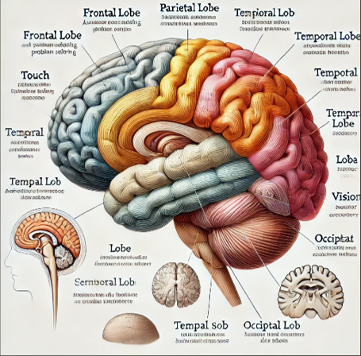

# Activating Distributed Visual Region within LLMs for Efficient and Effective Vision-Language Training and Inference

    

[**Activating Distributed Visual Region within LLMs for Efficient and Effective Vision-Language Training and Inference**](https://arxiv.org/abs/2412.12785) by
[Siyuan Wang](https://siyuanwangw.github.io/), 
[Dianyi Wang](https://github.com/AlenjandroWang), 
Chengxing Zhou,
[Zejun Li](https://scholar.google.com/citations?user=FYppLbUAAAAJ&hl=zh-CN),
[Zhihao Fan](https://libertfan.github.io/),
[Xuanjing Huang](https://xuanjing-huang.github.io/), and
[Zhongyu Wei](https://scholar.google.com/citations?user=AjLDxxgAAAAJ&hl=zh-CN).

> **Abstract.** Large Vision-Language Models (LVLMs) typically learn visual capacity through visual instruction tuning, involving updates to both a
projector and their LLM backbones. Inspired
by the concept of a visual region in the human
brain, we investigate the existence of an analogous visual region within LLMs that functions
as a cognitive core, and explore the potential
of efficient training of LVLMs via selective
layers tuning. Using Bunny-Llama-3-8B-V
for detailed analysis and other three LVLMs
for validation across diverse visual and textual
tasks, we find that selectively updating 25%
of LLMs layers, when sparsely and uniformly
distributed, can preserve nearly 99% of visual
performance and maintain or improve textual
task results, while effectively reducing training
time. Based on this targeted training approach,
we further propose a novel visual region-based
pruning paradigm, removing non-critical layers
outside the visual region, which can achieve
minimal performance loss. This study offers an
effective and efficient strategy for LVLM training and inference by activating a layer-wise
visual region within LLMs, which proves consistently effective across different models.

## Release

- [2025/05/15] 🔥🔥🔥 **Our paper has been accepted by ACL 2025!** 🔥🔥🔥
- [2024/12/17] 🔥 we release our paper, checkout the [paper](https://arxiv.org/pdf/2410.09575) for details.

The source code will be coming soon!
